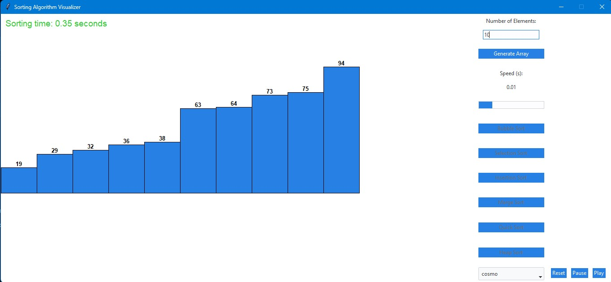

# Sorting Algorithm Visualizer

## Introduction

The Sorting Algorithm Visualizer is a Python application designed to help users understand and visualize how different sorting algorithms work. This application provides an interactive way to see the step-by-step process of sorting algorithms in action.



## Features

- **Multiple Sorting Algorithms**: Visualizes various sorting algorithms, including Bubble Sort, Selection Sort, Insertion Sort, Merge Sort, Quick Sort, and more.
- **Step-by-Step Visualization**: Shows each step of the sorting process, allowing users to follow along and understand the mechanics of each algorithm.
- **Interactive Controls**: Users can control the speed of the visualization, start, pause, and reset the sorting process.
- **Theme Management**: Users can change the theme
- **Educational Tool**: Ideal for students and educators to demonstrate and learn about sorting algorithms.

## Getting Started

### Prerequisites

Ensure you have Python installed on your system. You can download it from [python.org](https://www.python.org/).

### Installation

1. **Clone the repository**:
    ```python
    git clone https://github.com/ratamranjith/DataStructures.git
    ```
2. **Navigate to the project directory**:
    ```python
    cd Animations/Sorting
    ```
3. **Install the required dependencies**:
    ```python
    pip install ttkbootstrap
    ```

### Usage

1. **Run the application**:
    ```python
    python sorting_visualizer.py
    ```
2. **Interact with the visualizer**:
    - Input number of elements to be listed
    - Select the sorting algorithm you want to visualize.
    - Use the controls to start, pause, and reset the visualization.
    - Adjust the speed of the visualization to your preference.

## Sorting Algorithms Included

- **Bubble Sort**: A simple comparison-based algorithm that repeatedly steps through the list, compares adjacent elements, and swaps them if they are in the wrong order.
- **Selection Sort**: An in-place comparison-based algorithm that divides the input list into two parts: the sublist of items already sorted and the sublist of items remaining to be sorted.
- **Insertion Sort**: Builds the final sorted array one item at a time by repeatedly picking the next item and inserting it into the correct position.
- **Merge Sort**: A divide-and-conquer algorithm that divides the input array into two halves, sorts them, and then merges them back together.
- **Quick Sort**: A highly efficient divide-and-conquer algorithm that selects a 'pivot' element from the array and partitions the other elements into two sub-arrays, according to whether they are less than or greater than the pivot.
- **Heap Sort**: A comparison-based sorting technique based on Binary Heap data structure. It is similar to the selection sort where we first find the minimum element and place the minimum element at the beginning. Repeat the same process for the remaining elements.

## Contributing

Contributions are welcome! If you have any ideas for improvements or new features, feel free to submit a pull request or open an issue.

## Acknowledgements

- Inspired by various educational tools and visualizers available online.
- Thanks to all contributors and the open-source community.

## Contact

If you have any questions or feedback, please feel free to contact me at [ratamranjith@gmail.com].
